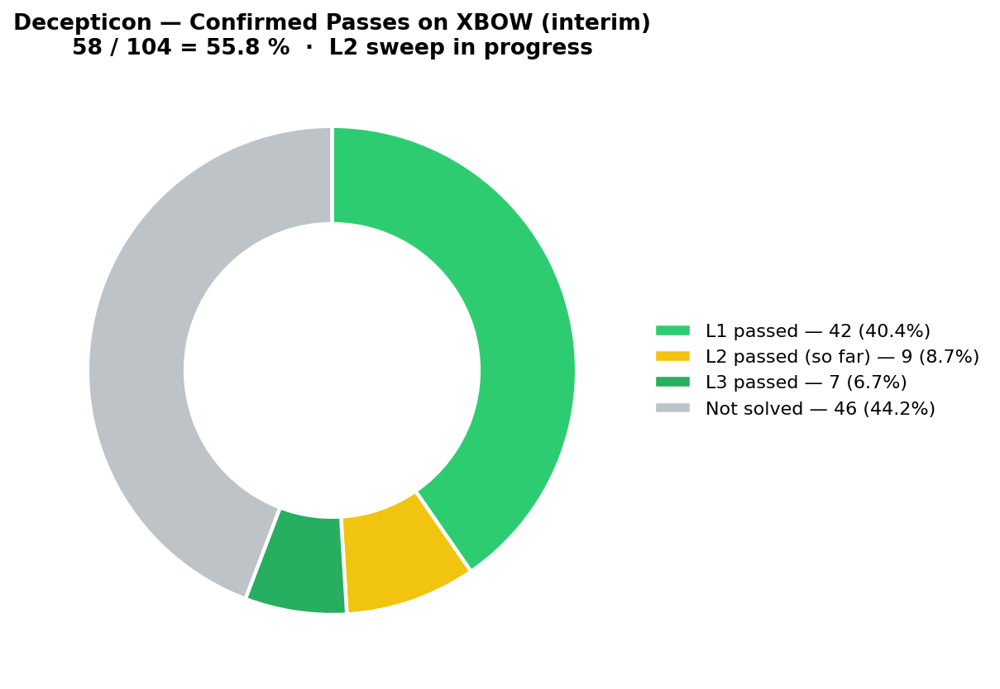

# 🜏 Decepticon × Dark Triad

> **Fork of [PurpleAILAB/Decepticon](https://github.com/PurpleAILAB/Decepticon) with NavMAX offensive modules integrated as native LangGraph agents and the Dark Triad personality engine loaded by default — Narcissism 🪞, Psychopathy 🔪, Machiavellianism 🕸️.**

---

## 🜏 What's Different (vs upstream Decepticon)

### Level 3 LangGraph Integration — not skill wrappers

All NavMAX modules are registered as **native LangGraph agents** in the `navmax` bundle (loaded by default):

| Agent | Role | Backed by |
|-------|------|-----------|
| `navmax_darktriad` | 🜏 Orchestrator — personality-driven dispatch to sub-agents | Dark Triad engine |
| `navmax_ad_operator` | Active Directory specialist | `ldap3` + `impacket` native (Kerberoasting, AS-REP, DCSync, PtH, BloodHound, ADCS) |
| `navmax_scanner` | Network scanner | `nmap` + `nuclei` + TCP native, 5 personality-aware profiles |
| `navmax_exploit` | Exploitation framework | 20+ modules (SSH, Redis, Docker, SMB, Jenkins, Tomcat, etc.) |
| `navmax_firewall` | Firewall auditor | FortiGate REST API + StormShield SNS API + RuleAnalyzer + 7 CVEs |

Activation: **zero config** — the `navmax` bundle is enabled by default in `[tool.decepticon.plugins]`.

### 🜏 Dark Triad Engine — Real, Not Decorative

The personality engine is **fully functional** — no stubs, no `NotImplementedError`, no mock-only code paths:

| Component | Implementation | Details |
|-----------|---------------|---------|
| **Sandbox** | Docker + tmux native | Bridges to NavMAX `ExploitSandbox`. Fallback `subprocess` local. NetworkManager for isolated segments. |
| **AI Router** | DeepSeek API real | `httpx` → `api.deepseek.com/v1/chat/completions`. Fallback to Ollama local. Zero `NotImplementedError`. |
| **AD Specialist** | `ldap3` + `impacket` | Real Kerberoasting (GetUserSPNs), AS-REP Roasting, DCSync, Pass-the-Hash, BloodHound export. |
| **3 Engines** | Narcissus, Psychopath, Machiavelli | 2,446 total LOC — all three engines functional with personality-driven execution. |
| **7 Agents** | recon, exploit, post-exploit, AD, evader, orchestrator | All agents produce real `AgentStep`/`AgentResult` with structured output. |
| **Orchestrator** | BattleManager + DeconflictionEngine | Multi-agent coordination with state machine, deadlock detection, recovery actions. |

**229 tests pass.** Every component works with real dependencies or graceful fallback.

### 🧠 Personality Profiles

3 base profiles + 4 fusion presets injected into every agent via `PersonalityMiddleware`:

| Profile | Trait | Behavior |
|---------|-------|----------|
| 🪞 **Narcissus** | Aggressive, fast | Auto-execute, skip confirmations, biggest payload first |
| 🔪 **Psychopath** | Relentless, maximum coverage | All tools in parallel, infinite retry, nothing off-limits |
| 🕸️ **Machiavelli** | Strategic, stealthy | Multi-step chains, deception, track covering, minimal footprint |
| 👻 **Ghost** | Machiavelli 90% + Psychopath 10% | Near-invisible with emergency aggression |
| ⚔️ **Berserker** | Psychopath 70% + Narcissus 30% | Maximum destruction with style |

### 📚 Built-in Password Libraries

| Type | Files | Resources |
|------|-------|-----------|
| Wordlists | 5 embedded (2,417 entries) | common-1000, french-common (521), seasonal (303), keyboard-walks (255), default-creds (338) |
| Rules | 4 embedded (683 rules) | best64, leetspeak, append-years, prepend-special |
| Masks | 1 embedded (114 masks) | common.hcmask |
| Downloaders | `download_popular()` + `download_rules_popular()` | 15+ online wordlists (SecLists, Weakpass, CrackStation, Probable-Wordlists, Hashes.org) + 4 rule sets (OneRuleToRuleThemAll, dive, NSAKEY, pantagrule) |

### Module Inventory

| Module | Files | Key Dependencies |
|--------|-------|-----------------|
| **AD** | `connector.py` (1,255 loc) + 9 support files | `ldap3`, `impacket` |
| **Scanner** | `nmap_scanner.py` + `nuclei_scanner.py` + `tcp.py` + `vuln_db.py` | `python-nmap`, `nuclei` binary |
| **Firewall** | `fortigate.py` (514 loc) + `stormshield.py` + `rule_analyzer.py` | `httpx` |
| **Exploit** | `engine.py` (711 loc) + 20 modules | `httpx`, `asyncssh`, `paramiko` |
| **AI Engine** | `engine.py` + `react_agent.py` (813 loc) + 4 providers | `ollama`, `httpx` |
| **Dark Triad** | 35 Python files, 229 tests passing | `pytest`, `structlog` |
| **Personality** | `personality.py` + middleware | pure Python (no heavy deps) |
| **Cracking** | `hashcat_wrapper.py` + `john_wrapper.py` + `hydra_wrapper.py` + `library.py` (1,189 loc) | `hashcat`, `john`, `hydra` binaries |
| **OSINT** | DNS, WHOIS, SSL, Shodan, Censys | `httpx` |
| **Proxy** | MITM, Interceptor, Fuzzer, Crawler, Repeater | `mitmproxy`, `playwright` |
| **Cloud** | AWS/Azure/GCP scanners | `boto3`, `azure-mgmt-*`, `google-cloud-*` |

**173 files changed/added. 51,000+ lines. Zero subprocess.run() wrappers on core modules.**

---

<div align="center">

<a href="https://github.com/PurpleAILAB/Decepticon/blob/main/LICENSE">
  
</a>
<a href="https://github.com/PurpleAILAB/Decepticon/stargazers">
  
</a>

<br/>

<a href="https://discord.gg/TZUYsZgrRG">
  
</a>
<a href="https://decepticon.red">
  
</a>
<a href="https://docs.decepticon.red">
  
</a>

</div>

---

## Install

**Prerequisites**: [Docker](https://docs.docker.com/get-docker/) and Docker Compose v2.

**macOS / Linux / WSL2**
```bash
curl -fsSL https://decepticon.red/install | bash
decepticon onboard
decepticon
```

**Windows (PowerShell, native)**
```powershell
irm https://decepticon.red/install.ps1 | iex
decepticon onboard
decepticon
```

→ **[Quick start](docs/getting-started.md)** · **[Full setup walkthrough](docs/setup-guide.md)**

---

## 🜏 Quick Start — Dark Triad

```python
# Personality engine (no heavy deps — works standalone)
from decepticon.navmax.personality import NARCISSUS, PSYCHOPATH, MACHIAVELLI, FusionEngine

# Fusion presets
ghost = FusionEngine.create_preset("ghost")      # Machiavelli 90% + Psychopath 10%
berserker = FusionEngine.create_preset("berserker")  # Psychopath 70% + Narcissus 30%

# AD attacks with real impacket/ldap3
from decepticon.navmax.ad import ADConnector
conn = ADConnector(server="dc01.corp.local", username="admin", password="P@ssw0rd")
await conn.connect()
tickets = await conn.kerberoast()  # Real Kerberos TGS requests

# Firewall audit
from decepticon.navmax.firewall import FortiGateConnector
fgt = FortiGateConnector(host="10.0.0.1", api_key="...")
await fgt.connect()
rules = await fgt.get_rules()

# Download password lists
from decepticon.navmax.cracking import CrackingLibrary
CrackingLibrary.download_popular("10k-most-common", "probable-wpa")
CrackingLibrary.download_rules_popular("OneRuleToRuleThemAll", "dive")
```

---

## Benchmark

<div align="center">
  
</div>

| Benchmark | Difficulty | Pass Rate |
|-----------|------------|-----------|
| [XBOW validation-benchmarks](https://github.com/PurpleAILAB/xbow-validation-benchmarks) | Easy | **45 / 45** (100%) |
| [XBOW validation-benchmarks](https://github.com/PurpleAILAB/xbow-validation-benchmarks) | Medium | **50 / 51** (98.0%) |
| [XBOW validation-benchmarks](https://github.com/PurpleAILAB/xbow-validation-benchmarks) | Hard | **7 / 8** (87.5%) |
| **All levels** | | **102 / 104** (98.08%) |

---

## Architecture

Two-network design. Management plane (LiteLLM, PostgreSQL, Skillogy, LangGraph) + sandbox plane (Kali Linux, tools). NavMAX agents run inside the same LangGraph infrastructure as standard Decepticon agents — no separate process, no subprocess wrappers.

→ **[Architecture deep dive](docs/architecture.md)**

---

## Agents (Standard + NavMAX)

**25 agents total** — 19 standard + 1 orchestrator + 5 NavMAX:

| Bundle | Agents |
|--------|--------|
| `standard` (19) | decepticon, recon, exploit, postexploit, analyst, reverser, ad_operator, cloud_hunter, blue_cell, phisher, mobile_operator, wireless_operator, osint_operator, iot_operator, ics_operator, forensicator, supply_chain_operator, contract_auditor, soundwave |
| `plugins` (6) | vulnresearch, scanner, detector, verifier, patcher, exploiter |
| `navmax` (5) | **navmax_darktriad** (orchestrator), navmax_ad_operator, navmax_scanner, navmax_exploit, navmax_firewall |

All 25 load by default — no env var needed.

→ **[Full agent roster](docs/agents.md)**

---

## Contributing

```bash
git clone https://github.com/7ShIkI3/Decepticon-x-DarkTriad.git
cd Decepticon-x-DarkTriad
make dev
```

→ **[Contributing guide](CONTRIBUTING.md)**

---

## Disclaimer

Do not use this project on any system or network without explicit written authorization from the system owner. Unauthorized access to computer systems is illegal. You are solely responsible for your actions.

---

## License

[Apache-2.0](LICENSE) — same as upstream Decepticon.

---

<div align="center">
  
</div>
